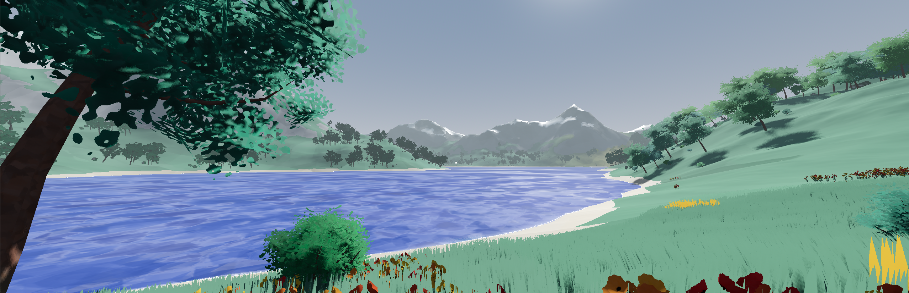

# Portfolio

Welcome to my portfolio! Here you can find all my projects, work experience, and more information about me. This portfolio is [hosted on GitHub Pages](https://jorisar.github.io/portfolio/).

## About Me

Hello everyone, My name is Joris, a Dutch Computer Science student at TU Delft Specializing in Computer Graphics. I enjoy working on challenging projects that involve rendering, visualization, and signal/data processing. You can learn more about me and my work through the projects listed [here](https://jorisar.github.io/portfolio/posts/).

## Contact

Feel free to reach out to me via email: [thatcodejar@gmail.com].

## Note

This repository is my personal portfolio, and I am **not** accepting contributions. However, you are welcome to explore my work and get in touch if you have any questions or feedback.

---

Thank you for visiting my portfolio!
